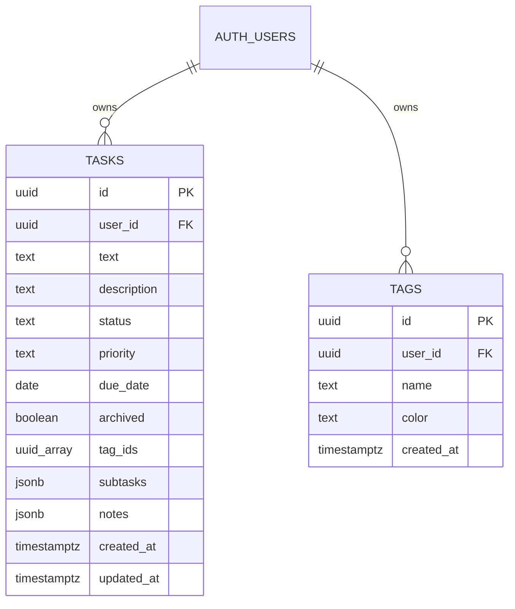

# Migrate Todo Dashboard to Next.js + Supabase + Vercel

## Enhancement Summary

**Deepened on:** 2026-02-14
**Sections enhanced:** All major sections
**Research agents used:** architecture-strategist, security-sentinel, performance-oracle, kieran-typescript-reviewer, data-integrity-guardian, code-simplicity-reviewer, julik-frontend-races-reviewer, spec-flow-analyzer, best-practices-researcher (drag-and-drop)

### Key Improvements
1. **Simplified schema from 5 tables to 2** — subtasks and notes stored as JSONB columns on the tasks table, eliminating 3 tables, 3 RLS policies, and junction-table complexity
2. **Optimistic updates are mandatory** — every reviewer flagged this as critical for drag-and-drop, subtask toggles, and note additions
3. **@dnd-kit recommended over HTML5 DnD** — mobile/touch support, accessibility, DragOverlay for optimistic UI
4. **8 race conditions identified** with concrete mitigation patterns for each
5. **Type layering strategy** — domain types separate from auto-generated DB types, with mapper functions and Zod validation at every server action boundary

### New Considerations Discovered
- Modal state must be snapshotted on open to avoid server revalidation overwriting user edits
- Drag operations must suppress React re-renders to prevent DOM node detachment
- `updated_at` needs a Postgres trigger — relying on application code is error-prone
- Password reset flow is missing from auth plan
- `ON DELETE CASCADE` on `user_id -> auth.users` risks mass data loss — use RESTRICT instead

---

## Overview

Migrate the existing vanilla HTML/CSS/JS Kanban todo dashboard to a Next.js App Router application backed by Supabase (database + auth), styled with Tailwind CSS, and deployed to Vercel. The current app is ~1100 lines of JS, ~200 lines of HTML, ~1000 lines of CSS with localStorage + optional Firebase sync.

## Problem Statement / Motivation

- **No persistence**: Data lives in localStorage/Firebase — no real database, no relational integrity
- **No authentication**: Anyone can see/modify all tasks
- **No deployment pipeline**: Static files with no CI/CD
- **Scaling limitations**: Vanilla JS becomes harder to maintain as features grow
- **Learning goal**: Gain experience with Next.js + Supabase stack

## Proposed Solution

Replace the entire frontend and backend with:

- **Next.js 15 (App Router)** — React-based framework with server components, server actions, and middleware
- **Supabase** — Postgres database with Row Level Security, Auth (email/password), and auto-generated REST API
- **Tailwind CSS** — Utility-first CSS replacing the current custom stylesheet
- **Vercel** — Zero-config deployment for Next.js
- **@dnd-kit** — Accessible drag-and-drop with touch support

> **Scope note:** OAuth/social login is explicitly deferred to a future iteration. V1 is email/password only.

## Technical Approach

### Architecture

```
┌─────────────────────────────────────────────┐
│                   Vercel                     │
│  ┌───────────────────────────────────────┐   │
│  │          Next.js App Router           │   │
│  │  ┌─────────┐  ┌──────────────────┐    │   │
│  │  │ Client  │  │ Server Actions   │    │   │
│  │  │ Comps   │  │ (mutations)      │    │   │
│  │  └────┬────┘  └────────┬─────────┘    │   │
│  │       │                │              │   │
│  │  ┌────┴────────────────┴─────────┐    │   │
│  │  │   Supabase Client (@supabase/ssr)  │   │
│  │  └────────────────┬──────────────┘    │   │
│  │                   │                   │   │
│  │  ┌────────────────┴──────────────┐    │   │
│  │  │   Middleware (auth refresh)   │    │   │
│  │  └───────────────────────────────┘    │   │
│  └───────────────────────────────────────┘   │
└──────────────────────┬───────────────────────┘
                       │ HTTPS
              ┌────────┴────────┐
              │    Supabase     │
              │  ┌────────────┐ │
              │  │  Postgres  │ │
              │  │  (+ RLS)   │ │
              │  ├────────────┤ │
              │  │    Auth    │ │
              │  └────────────┘ │
              └─────────────────┘
```

### Research Insights: Architecture

**Server/Client Component Boundary:**
- `app/dashboard/page.tsx` (server) fetches data, passes to `kanban-board.tsx` (client) — correct boundary
- All interactive components (board, modals, filter bar) must be client components
- `auth-form.tsx` can use plain HTML `<form>` with server action if no client-side validation UX is needed

**Data Fetching Strategy:**
- Server component should use a **single Supabase query with embedded selects** to avoid N+1:
  ```
  supabase.from('tasks').select('*, tags:tag_ids(*)').eq('user_id', userId)
  ```
- Keep filtering and search **entirely client-side** — data volume per user is small (<100KB), client-side filtering is sub-millisecond
- Use `useMemo` for filtered task computation, no debounce needed at this scale

**Missing from original plan:**
- `lib/queries/` directory to separate data fetching from page components
- `app/dashboard/loading.tsx` for skeleton UI during data fetch
- `app/dashboard/error.tsx` for error boundary
- Logout button + server action in dashboard layout
- Environment variable validation at startup

---

### Supabase Database Schema (Simplified — 2 Tables)

The original plan proposed 5 tables. After review, subtasks and notes are small bounded arrays that belong entirely to one task and are never queried independently. Using JSONB columns eliminates 3 tables, 3 RLS policies, and all junction-table complexity.

```sql
-- Users are managed by Supabase Auth (auth.users table)

-- Tags table
create table public.tags (
  id uuid default gen_random_uuid() primary key,
  user_id uuid references auth.users(id) on delete restrict not null,
  name text not null,
  color text not null default '#4a90d9',
  created_at timestamptz default now() not null,

  -- Constraints
  constraint chk_tags_name_not_empty check (length(trim(name)) > 0),
  constraint chk_tags_valid_color check (color ~ '^#[0-9a-fA-F]{6}$'),
  constraint uq_tags_user_name unique (user_id, name)
);

-- Tasks table (subtasks, notes, and tag IDs embedded)
create table public.tasks (
  id uuid default gen_random_uuid() primary key,
  user_id uuid references auth.users(id) on delete restrict not null,
  text text not null,
  description text default '',
  status text not null default 'not-started'
    check (status in ('not-started', 'in-progress', 'at-risk', 'completed')),
  priority text not null default 'medium'
    check (priority in ('high', 'medium', 'low')),
  due_date date,
  archived boolean default false not null,
  tag_ids uuid[] default '{}',
  subtasks jsonb default '[]'::jsonb,
  notes jsonb default '[]'::jsonb,
  created_at timestamptz default now() not null,
  updated_at timestamptz default now() not null,

  -- Constraints
  constraint chk_tasks_text_not_empty check (length(trim(text)) > 0)
);

-- Indexes
create index idx_tasks_user_id on public.tasks (user_id);
create index idx_tasks_user_status_archived on public.tasks (user_id, status, archived);
create index idx_tasks_user_due_date on public.tasks (user_id, due_date) where due_date is not null;
create index idx_tags_user_id on public.tags (user_id);

-- Auto-update updated_at trigger
create or replace function update_updated_at_column()
returns trigger as $$
begin
  new.updated_at = now();
  return new;
end;
$$ language plpgsql;

create trigger trg_tasks_updated_at
  before update on public.tasks
  for each row execute function update_updated_at_column();
```

### Research Insights: Schema Design

**Why 2 tables instead of 5:**
- Subtasks and notes are small bounded arrays owned by one task, never queried independently
- The current app already stores them as embedded arrays — migration preserves this simplicity
- Eliminates `task_tags`, `subtasks`, `notes` tables + 3 RLS policies + junction-table management
- Postgres `uuid[]` and `jsonb` are purpose-built for this pattern

**Why `on delete restrict` instead of `cascade` on auth.users FK:**
- `ON DELETE CASCADE` on `user_id -> auth.users` would silently destroy ALL user data if a user is deleted from Supabase Auth
- `ON DELETE RESTRICT` prevents accidental mass deletion — user deletion must be handled through an explicit procedure

**Key constraints added:**
- `chk_tags_valid_color`: Strict hex-only regex prevents CSS injection via tag color values
- `chk_tags_name_not_empty` / `chk_tasks_text_not_empty`: Prevents empty text at DB level
- `uq_tags_user_name`: Prevents duplicate tag names per user
- `updated_at` trigger: Automatic, no reliance on application code

### ERD



### Row Level Security Policies

```sql
alter table public.tasks enable row level security;
alter table public.tags enable row level security;

-- Tasks: users see/modify only their own
create policy "Users manage own tasks" on public.tasks
  for all using (auth.uid() = user_id)
  with check (auth.uid() = user_id);

-- Tags: users see/modify only their own
create policy "Users manage own tags" on public.tags
  for all using (auth.uid() = user_id)
  with check (auth.uid() = user_id);
```

### Research Insights: Security

**Input validation is non-negotiable** — server actions are publicly callable HTTP endpoints:

| Field | Validation |
|---|---|
| Task text | `z.string().trim().min(1).max(500)` |
| Description | `z.string().trim().max(2000)` |
| Notes text | `z.string().trim().min(1).max(5000)` |
| Tag name | `z.string().trim().min(1).max(50)` |
| Tag color | `z.string().regex(/^#[0-9a-fA-F]{6}$/)` |
| Priority | `z.enum(['high', 'medium', 'low'])` |
| Status | `z.enum(['not-started', 'in-progress', 'at-risk', 'completed'])` |
| Due date | `z.string().date().nullable()` |

**Every server action must independently verify auth** — do not rely solely on middleware:
```typescript
const { data: { user } } = await supabase.auth.getUser();
if (!user) throw new Error('Unauthorized');
```

**Security headers** — add CSP, X-Frame-Options in `next.config.ts`.

**Never expose `SUPABASE_SERVICE_ROLE_KEY`** with `NEXT_PUBLIC_` prefix.

---

### Next.js Project Structure

```
todo-dashboard/
├── app/
│   ├── layout.tsx                # Root layout (Tailwind, fonts)
│   ├── page.tsx                  # Landing/redirect → /dashboard or /login
│   ├── login/
│   │   └── page.tsx              # Login/signup form (inline, no separate component)
│   ├── forgot-password/
│   │   └── page.tsx              # Password reset request form
│   ├── reset-password/
│   │   └── page.tsx              # New password form (from email link)
│   ├── auth/
│   │   └── callback/
│   │       └── route.ts          # PKCE code exchange route handler
│   ├── dashboard/
│   │   ├── layout.tsx            # Auth-protected layout + logout button
│   │   ├── page.tsx              # Server component: fetch tasks+tags, pass to board
│   │   ├── loading.tsx           # Skeleton UI while fetching
│   │   └── error.tsx             # Error boundary
│   └── globals.css               # Tailwind directives
├── components/
│   ├── kanban-board.tsx          # Client component — DndContext, columns, optimistic state
│   ├── task-card.tsx             # Draggable card with useSortable
│   ├── task-modal.tsx            # Combined view + edit modes (single component)
│   ├── tag-manager-modal.tsx     # Tag CRUD modal
│   └── filter-bar.tsx            # Search + tag filter dropdown
├── lib/
│   ├── supabase/
│   │   ├── client.ts             # createBrowserClient factory
│   │   ├── server.ts             # createServerClient factory (async, uses cookies)
│   │   └── middleware.ts         # Middleware Supabase client factory
│   ├── actions.ts                # ALL server actions (6 functions, ~150 lines)
│   ├── queries.ts                # Data fetching functions used by server components
│   ├── schemas.ts                # Zod validation schemas
│   └── types/
│       ├── domain.ts             # Application-level types (Task, Tag, etc.)
│       └── database.types.ts     # Auto-generated Supabase types
├── middleware.ts                  # Auth token refresh + route protection
├── supabase/
│   ├── config.toml
│   └── migrations/
│       └── 00001_initial_schema.sql
├── tailwind.config.ts
├── next.config.ts
├── package.json
└── .env.local
```

### Research Insights: Project Structure

**Simplifications from original plan:**
- **1 action file** instead of 4 — total is ~6 functions (~150 lines), doesn't need 4 files
- **5 components** instead of 8 — merged view+edit modals, dropped kanban-column (inline in board), inlined auth form
- **Added `lib/queries.ts`** — separates data fetching from page components
- **Added `lib/schemas.ts`** — Zod schemas as single source of truth for validation
- **Added `lib/types/domain.ts`** — application types separate from DB types
- **Added `loading.tsx` / `error.tsx`** — proper loading states and error boundaries
- **Added `forgot-password` + `reset-password` routes** — missing from original

---

### Type System Architecture

```
database.types.ts  (auto-generated, raw DB row types)
        ↓  mapper functions
domain.ts          (application types: Task, Tag, Subtask, Note)
        ↓  passed as props
components         (render from domain types, never from DB types)
        ↑  validated by
schemas.ts         (Zod schemas, inferred types for forms)
```

**Key types in `lib/types/domain.ts`:**

```typescript
export const TASK_STATUS = {
  NOT_STARTED: "not-started",
  IN_PROGRESS: "in-progress",
  AT_RISK: "at-risk",
  COMPLETED: "completed",
} as const;
export type TaskStatus = (typeof TASK_STATUS)[keyof typeof TASK_STATUS];

export const TASK_PRIORITY = { HIGH: "high", MEDIUM: "medium", LOW: "low" } as const;
export type TaskPriority = (typeof TASK_PRIORITY)[keyof typeof TASK_PRIORITY];

export interface Task {
  readonly id: string;
  readonly text: string;
  readonly description: string;
  readonly status: TaskStatus;
  readonly priority: TaskPriority;
  readonly dueDate: string | null;
  readonly tags: readonly Tag[];     // Hydrated at query level, NOT raw IDs
  readonly subtasks: readonly Subtask[];
  readonly notes: readonly Note[];
  readonly archived: boolean;
  readonly createdAt: string;
  readonly updatedAt: string;
}
```

**Server action pattern** — input typed as `unknown`, Zod validates, returns discriminated union:

```typescript
type ActionResult<T = void> =
  | { success: true; data: T }
  | { success: false; error: string; fieldErrors?: Record<string, string[]> };

export async function createTask(input: unknown): Promise<ActionResult<{ id: string }>> {
  const parsed = createTaskSchema.safeParse(input);
  if (!parsed.success) return { success: false, error: "Validation failed", fieldErrors: ... };
  // ...
}
```

---

### Drag-and-Drop: @dnd-kit

**Recommendation: `@dnd-kit/core` + `@dnd-kit/sortable`** (~15KB gzipped)

| Requirement | How @dnd-kit handles it |
|---|---|
| Mobile/touch | `TouchSensor` with 250ms activation delay to distinguish drag from scroll |
| Accessibility | Built-in ARIA announcements, keyboard navigation (spacebar lift, arrows, spacebar drop) |
| Optimistic UI | `<DragOverlay>` renders floating card clone — original slot updates instantly |
| Server action on drop | `onDragEnd` callback receives active + over context, fire server action there |
| Within-column reorder | `@dnd-kit/sortable` handles this if desired (deferred to v2) |

**Why not others:**
- HTML5 DnD API: No mobile/touch support, no accessibility — disqualified
- @hello-pangea/dnd: Maintenance risk (volunteer team), uncertain React 19 support
- Pragmatic DnD (Atlassian): Touch support requires additional packages

---

### Optimistic Updates & Race Condition Mitigations

**8 race conditions were identified.** The top 4 require explicit handling:

#### Race 1: Rapid Drag-Drop-Drag-Drop
Two quick drags can cause the second server action to read stale state.

**Mitigation:** Serialize mutations with a queue + `useOptimistic`:
```typescript
const mutationQueue = useRef(Promise.resolve());
const [optimisticTasks, addOptimistic] = useOptimistic(serverTasks, reducer);

function handleDrop(taskId, newStatus) {
  startTransition(async () => {
    addOptimistic({ taskId, newStatus });
    mutationQueue.current = mutationQueue.current.then(
      () => updateTaskStatusAction(taskId, newStatus)
    );
  });
}
```

#### Race 2: Modal State vs. Server Revalidation
`revalidatePath` can overwrite modal content while user is editing.

**Mitigation:** Snapshot task data when modal opens. Render from local state, not server props:
```typescript
const [localTask, setLocalTask] = useState(null);
useEffect(() => {
  if (isOpen && task) setLocalTask(structuredClone(task));
}, [isOpen, task?.id]); // task.id, NOT task object
```

#### Race 3: Drag + React Reconciliation = Detached DOM Node
If React re-renders mid-drag, the browser loses its reference to the dragged DOM node.

**Mitigation:** Suppress re-renders while dragging:
```typescript
const isDragging = useRef(false);
useEffect(() => {
  if (!isDragging.current) setDisplayTasks(serverTasks);
  else pendingRef.current = serverTasks;
}, [serverTasks]);
```

#### Race 4: View-to-Edit Modal Data Loss
User toggles subtasks in view modal, switches to edit — edit modal reads stale server state.

**Mitigation:** Single `dirtyTask` state shared between view and edit modes (both are inside `task-modal.tsx`).

#### Additional mitigations:
- **Concurrent note additions:** With JSONB, notes are updated atomically on the task row — no lost-update problem
- **Filter/search state:** Keep in client `useState`, never in URL params — survives revalidation
- **Testing strategy:** Add `await new Promise(r => setTimeout(r, 2000))` to server actions during dev to expose all races

---

### Implementation Phases (Simplified — 3 Phases)

#### Phase 1: Scaffolding + Auth + Deploy Skeleton

- [ ] `npx create-next-app@latest` with App Router + Tailwind CSS
- [ ] Install: `@supabase/supabase-js`, `@supabase/ssr`, `@dnd-kit/core`, `@dnd-kit/sortable`, `@dnd-kit/utilities`, `zod`
- [ ] Create Supabase project, run `supabase init`, `supabase link`
- [ ] Create `supabase/migrations/00001_initial_schema.sql` (2 tables, RLS, indexes, trigger)
- [ ] Push migration: `supabase db push`
- [ ] Generate types: `supabase gen types typescript --project-id <id> > lib/types/database.types.ts`
- [ ] Create `lib/types/domain.ts` — application-level types
- [ ] Create `lib/schemas.ts` — Zod validation schemas
- [ ] Create `lib/supabase/client.ts`, `lib/supabase/server.ts`, `lib/supabase/middleware.ts`
- [ ] Create `middleware.ts` — refresh auth via `getUser()`, redirect unauthenticated from `/dashboard`
- [ ] Create `app/login/page.tsx` — email/password login + signup form
- [ ] Create `app/forgot-password/page.tsx` — password reset request
- [ ] Create `app/reset-password/page.tsx` — new password form
- [ ] Create `app/auth/callback/route.ts` — PKCE code exchange
- [ ] Create `app/page.tsx` — redirect based on auth state
- [ ] Configure Supabase Auth: disable email confirmation for v1, set Site URL + Redirect URLs
- [ ] Set up `.env.local` with `NEXT_PUBLIC_SUPABASE_URL` and `NEXT_PUBLIC_SUPABASE_ANON_KEY`
- [ ] Push to GitHub, connect to Vercel, add env vars, deploy empty shell
- [ ] Verify: can sign up, log in, see empty dashboard, log out

**Files:** `package.json`, `supabase/migrations/00001_initial_schema.sql`, `lib/types/*`, `lib/schemas.ts`, `lib/supabase/*`, `middleware.ts`, `app/login/page.tsx`, `app/forgot-password/page.tsx`, `app/reset-password/page.tsx`, `app/auth/callback/route.ts`, `.env.local`

#### Phase 2: Kanban Board + Server Actions

- [ ] Create `lib/actions.ts` — `createTask`, `updateTask`, `updateTaskStatus`, `deleteTask`, `archiveCompletedTasks`, `createTag`, `deleteTag` (all with Zod validation, auth check, ActionResult return type)
- [ ] Create `lib/queries.ts` — `getTasksWithTags(userId)`, `getTags(userId)`
- [ ] Create `app/dashboard/layout.tsx` — auth-protected layout + logout button
- [ ] Create `app/dashboard/page.tsx` — server component, fetch via `lib/queries.ts`, pass to board
- [ ] Create `app/dashboard/loading.tsx` — skeleton UI
- [ ] Create `app/dashboard/error.tsx` — error boundary
- [ ] Create `components/kanban-board.tsx` — DndContext, 4 columns inline, `useOptimistic`, mutation queue, drag-render suppression
- [ ] Create `components/task-card.tsx` — `useSortable` from @dnd-kit, tag badges, priority, due date, subtask/note counts
- [ ] Create `components/task-modal.tsx` — combined view/edit with `mode` state, local `dirtyTask` snapshot, subtask toggles, note adding, edit form with description/due date/priority/subtasks/tags
- [ ] Create `components/tag-manager-modal.tsx` — tag CRUD with color picker (hex validation)
- [ ] Create `components/filter-bar.tsx` — search input + multi-select tag filter (client-side filtering with `useMemo`)
- [ ] Rewrite all styles in Tailwind — map existing design tokens first
- [ ] Empty states: "No tasks yet — create your first task above" in columns, "No tags created" in filter dropdown
- [ ] Handle archived task drag: if archived task is dragged to non-completed column, auto-unarchive
- [ ] Verify: all CRUD works, drag-and-drop works on desktop + mobile, modals work, filter/search works

**Files:** `lib/actions.ts`, `lib/queries.ts`, `app/dashboard/*`, `components/*`

#### Phase 3: Data Migration (Optional)

- [ ] Create `scripts/migrate-data.ts` — runs client-side in the browser (reads localStorage)
- [ ] Migration flow: read localStorage JSON → insert tags first → build `oldId -> newUuid` map → insert tasks with remapped tag_ids
- [ ] Convert timestamps: `Date.now()` integers → ISO 8601 strings
- [ ] Idempotency: check if tasks already exist before inserting (by text + createdAt)
- [ ] Handle duplicate tag IDs from source data
- [ ] Add a "Import from Local" button in dashboard that triggers migration once
- [ ] Run once, then hide the button

**Files:** `scripts/migrate-data.ts` or inline migration component

---

## Acceptance Criteria

### Functional Requirements

- [ ] Users can sign up, log in, and log out with email/password
- [ ] Users can request password reset via email
- [ ] Each user sees only their own tasks (RLS enforced)
- [ ] All existing features work: Kanban board, drag-and-drop (desktop + mobile), tags, due dates, priorities, search, subtasks, notes, archive/unarchive
- [ ] Data persists in Supabase Postgres (no localStorage dependency)
- [ ] App is deployed and accessible on Vercel
- [ ] Empty states shown for new users with no tasks/tags

### Non-Functional Requirements

- [ ] Auth tokens refresh automatically via middleware
- [ ] Every server action validates input with Zod and verifies auth independently
- [ ] Server actions return `ActionResult` — no thrown exceptions, errors surfaced via toast
- [ ] Optimistic updates for drag-and-drop + subtask toggles (UI feels instant)
- [ ] RLS policies prevent cross-user data access
- [ ] TypeScript types generated from database schema + domain type layer
- [ ] Responsive design: 4-column horizontal scroll on mobile
- [ ] Drag-and-drop works on touch devices via @dnd-kit TouchSensor

## Dependencies & Risks

| Risk | Severity | Mitigation |
|---|---|---|
| Drag-and-drop mid-rerender detaches DOM node | High | Suppress React re-renders while `isDragging` ref is true |
| Modal data overwritten by server revalidation | High | Snapshot local state on modal open, render from snapshot |
| Rapid mutations read stale server state | High | Serialize mutations via promise queue + useOptimistic |
| Tailwind rewrite effort (~1000 lines CSS) | Medium | Map existing design tokens first, convert per component |
| Supabase cold starts on free tier | Low | Acceptable for personal use; consider Edge Runtime for status updates |
| @dnd-kit v1.0 rewrite could change API | Low | Pin dependency to `^0.x`, upgrade when migration guide available |

## Performance Recommendations

- **Deploy Supabase and Vercel in the same region** (e.g., both `us-east-1`) — cross-region adds 50-150ms per query
- **Use `revalidateTag` instead of `revalidatePath`** for granular cache invalidation as app grows
- **Batch archive** — single SQL `UPDATE ... WHERE status = 'completed'`, not per-task mutations
- **Consider Edge Runtime** for `updateTaskStatus` server action to eliminate cold-start latency on the most time-sensitive path
- **Defer subtask/note fetching to modal open** if task count exceeds 500 (future optimization)

## References & Research

### Internal References
- Current app entry: `index.html` (196 lines)
- Current JS logic: `script.js` (1114 lines) — all CRUD, rendering, drag-and-drop, modals
- Current styles: `style.css` (~1000 lines)
- Firebase config (to be removed): `firebase-config.js`

### External References
- Supabase + Next.js guide: https://supabase.com/docs/guides/auth/server-side/nextjs
- `@supabase/ssr` package: https://github.com/supabase/auth-helpers
- Next.js App Router docs: https://nextjs.org/docs/app
- Tailwind CSS docs: https://tailwindcss.com/docs
- Vercel deployment: https://vercel.com/docs/frameworks/nextjs
- @dnd-kit docs: https://docs.dndkit.com
- React 19 useOptimistic: https://react.dev/reference/react/useOptimistic
